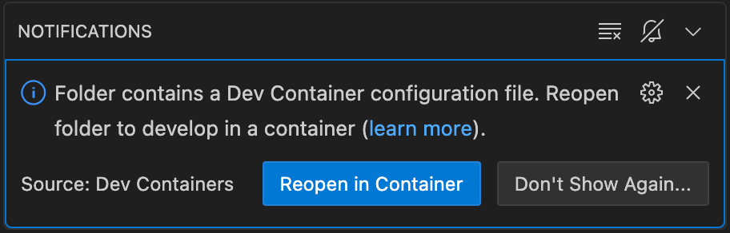
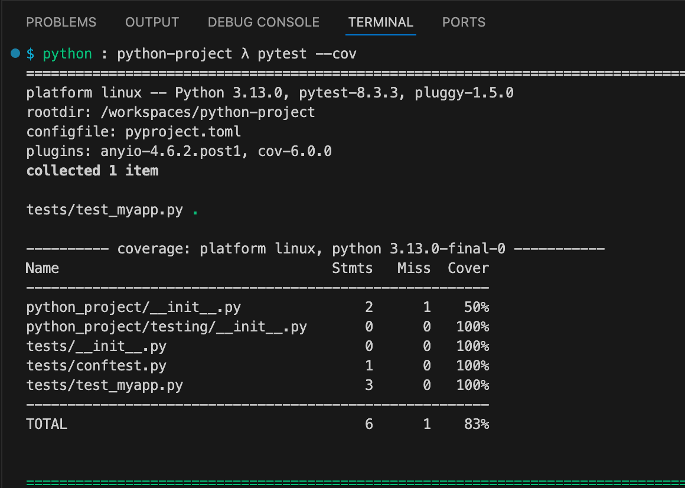
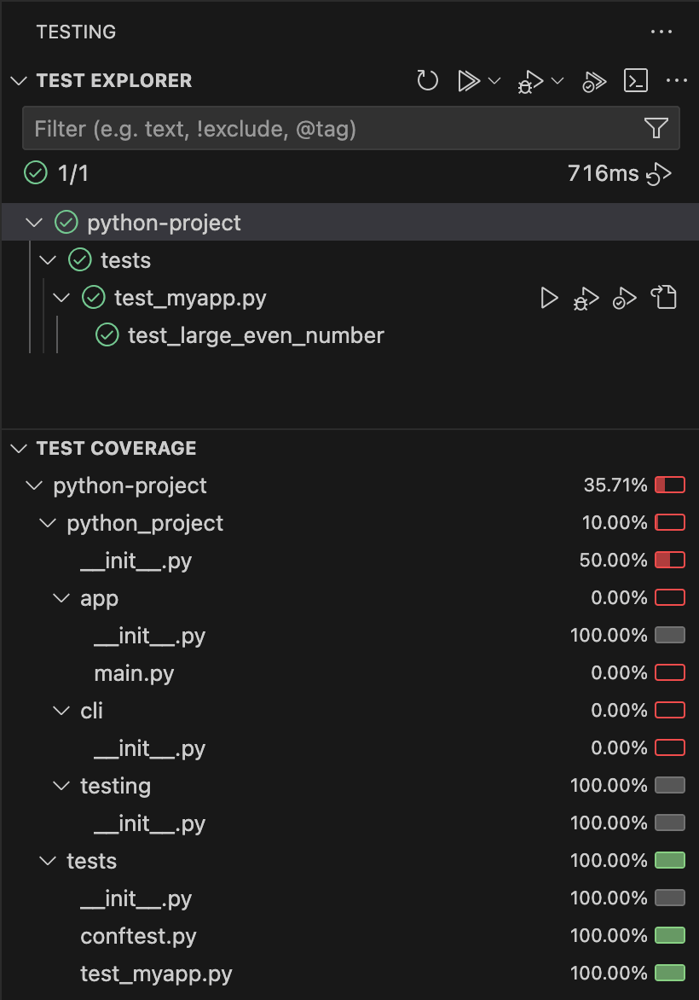
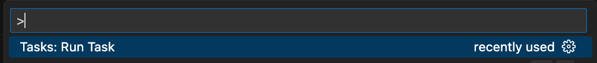
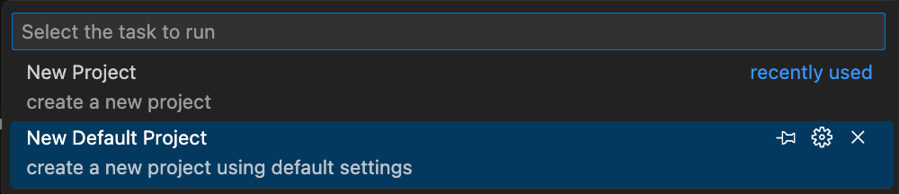
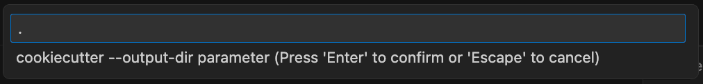
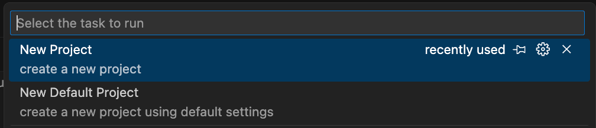
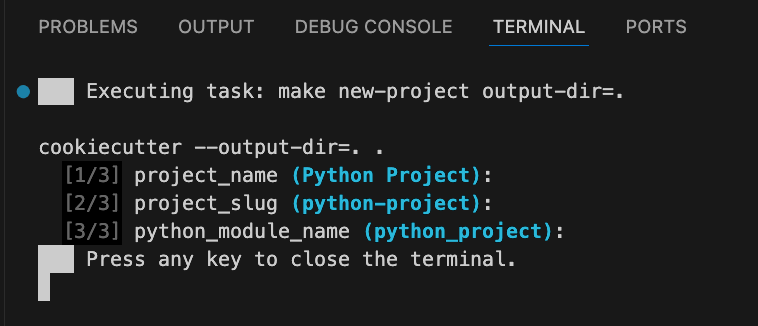
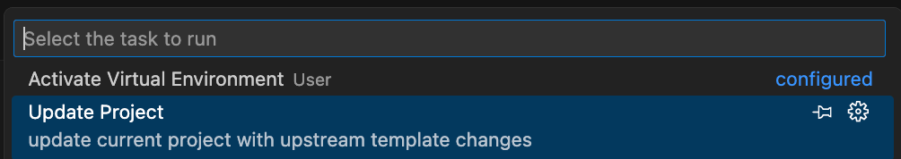
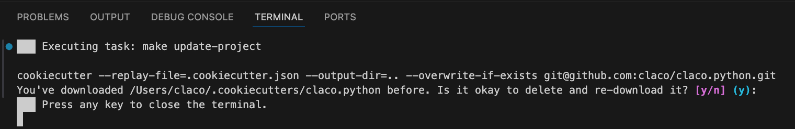

# claco.python

Cookiecutter template for Python projects

## Description

This repository provides a cookiecutter template used to kick start new Python projects that can be easily updated with new upstream template changes.

The generated project supports the following:

- pytest+coverage support in Visual Studio Code ui and command line
- fastapi
- devcontainers in Visual Studio Code





## Getting Started

For each of the methods listed below, there are two primary workflows used to generate new projects:

- default project: use settings in `cookiecutter.json` and don't prompt for input
- new project: use settings in `cookiecutter.json` but prompt for changes

### Make

This repository has a `Makefile` which you can use to generate new projects in an already cloned repository:

```shell
% make

Usage: make [target] [argument=value] ...

default-project                create a new project using default settings
new-project                    create a new project
```

#### default-project

```shell
% make default-project # output-dir=${PWD}
% make default-project output-dir=new-project

cookiecutter --no-prompt --output-dir=${output-dir} .
```

#### new-project

```shell
% make new-project # output-dir=${PWD}
% make new-project output-dir=new-project

cookiecutter --output-dir=${output-dir} .
  [1/3] project_name (Python Project): 
  [2/3] project_slug (python-project): 
  [3/3] python_module_name (python_project): 
```

### Visual Studio Code

This repository has Tasks defined which you can run them by choosing "Tasks: Run Task" in the Command Palette.



#### default-project




#### new-project





## Updating Your Project

The generated project has the ability to download the latest template and apply it to the current project.

__This will apply changes to all existing files. It is recomended that you commit or stash your current work, and then use your favorite git diff viewer to stage or revert changes on a file by file basis based on your current projects needs.__

### Make

The generated project has a `Makefile` which you can use to update the existing project:

```shell
% make

Usage: make [target] [argument=value] ...

update-project                update current project with upstream template changes
```

#### update-project

```shell
% make update-project # template=`git config --get remote.origin.url`
% make update-project template=https://github.com/some/other/template

cookiecutter --replay-file=.cookiecutter.json --output-dir=.. --overwrite-if-exists ${template}
```

### Visual Studio Code

This repository has a Task defined which you can run them by choosing "Tasks: Run Task" in the Command Palette.


#### update-project



